# Языки программирования
## Лабораторная работа 3

### Задание 1 **(3)**
*Составьте глоссарий из определений лекции. Проверка отчета будет включать проверку знания определений*
* **Тип в программировании** - атрибут объекта данных, задающий множество допустимых значений и методы для работы с ними;
* **Статическая типизация** - тип объекта данных определяется в момент трансляции;
* **Динамическая типизация** - тип объекта данных определяется на этапе выполнения программы в момент создания или присваивания значения;
* **Неявная типизация** - тип определяется на этапе трансляции автоматически по тексту программы;
* **Явное преобразование типа** - преобразование типа называется явным, если оно указано в программе в виде вызова функции или в виде операции;
* **Неявное преобразование типа** - преобразование типа называется неявным, если оно не присутствует в программе в виде конкретного указания, однако транслятор сам подставляет требуемый метод преобразования;
* **Сильная типизация** - язык программирования не содержит (почти не содержит) правил неявного преобразования типа;
* **Слабая типизация** - язык программирования содержит большое число правил неявного преобразования типа, допускает каламбуры типизации.


### Задание 2 **(3)**
*Запишите правила неявного преобразования типов в языке С++*

*Преобразования при присваивании*
* Значение правого операнда приводится к типу левого операнда.
* Преобразование в bool: 0 — это false; все остальные значения — true.
* Преобразование из bool: false — это 0; true — это 1.
* Преобразование из вещественных в целочисленные: дробная часть отсекается (не округляется!).
* Преобразование с символьными типами: выполняется по коду символа (например, 'A' превращается в число 65).

*Преобразования при арифметических действиях* 
* Если длины обоих типов меньше int, то оба преобразуются к int.
* Если типы разной длины, то меньший тип преобразуется к большему.
* Если типы равной длины, и один знаковый (signed), а другой беззнаковый (unsigned), то знаковый приводится к беззнаковому.
* Если один тип целый, а другой вещественный, то целый приводится к вещественному.

*Преобразования с логическими значениями*
* В bool: 0 — это false; все остальные значения — true.
* Из bool: false — это 0; true — это 1.
* Результат условного выражения в инструкциях ветвления (if) и цикла (while) приводится к логическому типу. 
* Если оператор требует логического значения, то операнды приводятся к логическому типу (логические операции).


### Задание 3 **(2)**

*Языки C++ и Java имеют похожий синтаксис, однако
язык С++ относят к языкам со слабой статической типизацией, а Java - с сильной статической типизацией.
Приведите примеры, показывающие это различие. Для этого вам надо подобрать несколько близких по смыслу фрагментов программ,
которые будут транслироваться в С++, но вызывать ошибку согласования типов в Java.*


* код на C++:
```cpp
#include <iostream>

int main() {
    double d = 3.14;
    int x = d; 
    std::cout << x << std::endl;
    return 0;
}
```
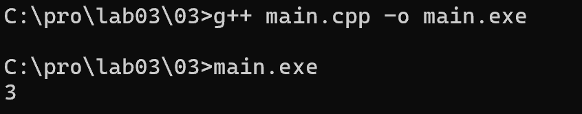

* Программа успешно компилируется и выводит число 3.
Дробная часть числа 3.14 отсекается.

* тот же код на Java:
```
public class Main {
    public static void main(String[] args) {
        double d = 3.14;
        int x = d;
        System.out.println(x);
    }
}
```
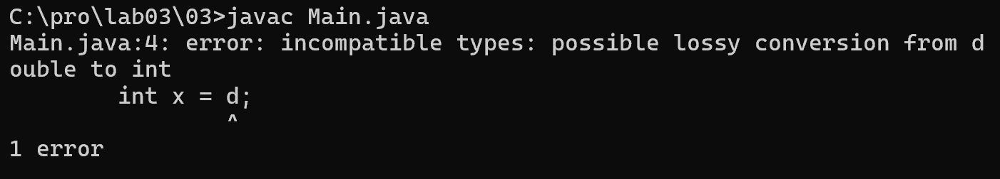

* язык запрещает неявное сужение, потому что при этом теряется дробная часть. Компилятор выдаёт ошибку.


*Записанные программы сохраните в папке с номером задания. В отчет запишите пояснения к работе программ.*


### Задание 4 **(1)**

*Рассмотрите следующий фрагмент программы.*
```
bool x = true, y = false;
auto a = x & y;
std::cout << typeid(a).name() << std::endl;
auto b = x && y;
std::cout << typeid(b).name() << std::endl;
```
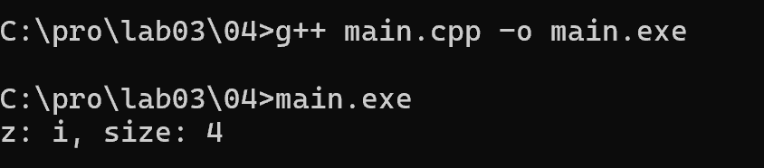 
*Используя* **typeid**, *найдите типы переменных* **a** и **b**. *Объясните результат.*

* переменная a(x & y) — оператор & побитовый, работает с целыми. bool неявно превращается в int, результат — int.
* переменная b (x && y) — оператор && логический, работает с bool. Результат — bool.
* переменная z (x + y) — оператор + арифметический, работает с числами. bool неявно превращается в int, результат — int.
* & и + дают int, && даёт bool.

*Записанную программу сохраните в папке с номером задания.*


### Задание 5. **(2)**

*Приведите разумные (логичные) примеры использования в 
С++ ключевых слов* **typedef, auto, decltype, static_cast** и оператора **sizeof**.

* Пример typedef: 
```#include <iostream>

typedef long long ll;

int main() {
    ll a = 100;
    std::cout << a << std::endl;
    return 0;
}
```
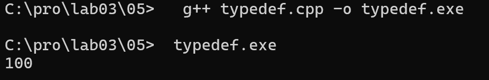

* создаёт короткое имя ll для типа long long

* пример auto:
```
#include <iostream>

int main() {
    auto b = 5;
    auto c = 3.14;
    std::cout << b << " " << c << std::endl;
    return 0;
}
```
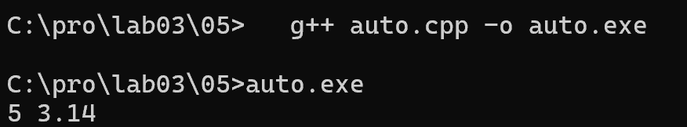

* автоматически выводит тип переменной из её значения. auto b = 5; -> b это int.

* пример decltype:
```
#include <iostream>

int main() {
    int x = 5;
    decltype(x) y = 10;
    std::cout << y << std::endl;
    return 0;
}
```
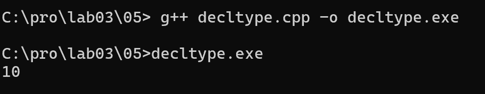

* y получает тот же тип, что и x (то есть int), но значение у неё своё (10).

* пример static_cast:
```
#include <iostream>

int main() {
    double d = 3.99;
    int e = sttic_cast<int>(d);
    std::cout << e << std::endl;
    return 0;
}
```
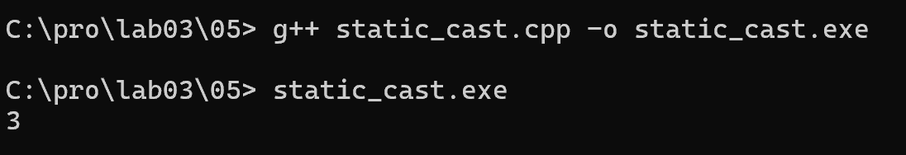


*  явно превращает double в int. Дробная часть отсекается: 3.99 ->  3. 

* пример sizeof:
```
#include <iostream>

int main() {
    std::cout << sizeof(int) << std::endl;
    std::cout << sizeof(double) << std::endl;
    return 0;
}
```
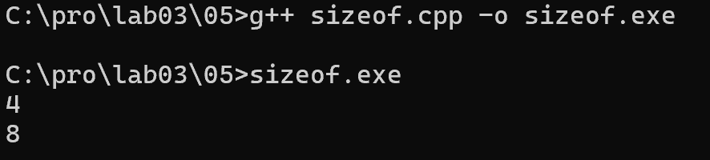

* возвращает размер типа int в байтах (4). sizeof(double) — размер double (8).

*Записанные программы сохраните в папке с номером задания. В отчет запишите пояснения к программам*.

* *Объясните работу этой программы, используя правила неявного преобразования типов*
* *Что произойдет, если тип* **int** *заменить на* **short**, а **unsigned int** на **unsigned short**?*


### Задание 6 **(2)**

Рассмотрите следующий фрагмент программы.
 
```
int a = -1, b = 1;
unsigned int c = 1;
std::cout << a*b << std::endl;
std::cout << a*c << std::endl;
```   
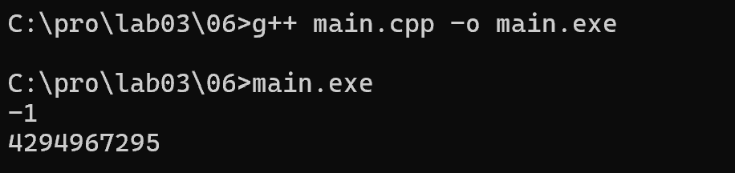

* В первой строке a * b оба операнда — int. Преобразований нет, результат: -1.
* Во второй строке a * c операнды — int и unsigned int. По правилу неявного преобразования (типы равной длины, один знаковый, другой беззнаковый) знаковый тип приводится к беззнаковому. Число -1 в unsigned int становится 4294967295. Результат: 4294967295.

* если заменить int на short, а unsigned int на unsigned short:
```
#include <iostream>

int main() {
    short a = -1, b = 1;
    unsigned short c = 1;
    std::cout << a * b << std::endl;
    std::cout << a * c << std::endl;
    return 0;
}
```
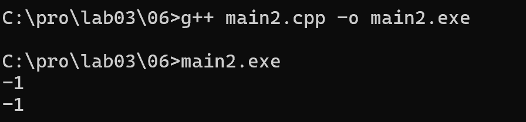

* short и unsigned short занимают 2 байта — меньше, чем int (4 байта). По правилу неявного преобразования, если оба типа короче int, они приводятся к int. Поэтому -1 остаётся -1, знаковость сохраняется. Результат обеих строк: -1.


### Задание 7 **(2)**

*Рассмотрите следующий фрагмент программы.*

```
int x = 7, y = 4;
long double d = 0.25;
cout << (x / y) / d << endl;
cout << (x / d) / y << endl;
long a = 200000, b = 200000;
long long c = 200000;
std::cout << (a * b) * c << std::endl;
std::cout << a * (b * c) << std::endl;
```
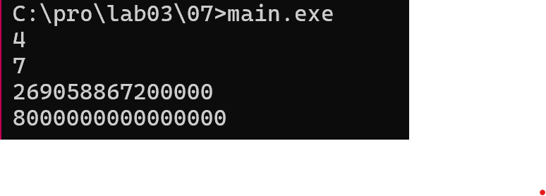

*Почему изменения порядка действий приводит
к изменению результата? Объясните работу этой программы, используя правила неявного преобразования типов*


* (x / y) / d -> сначала 7 / 4 = 1 (целочисленное деление, дробная часть отсекается). Затем 1 / 0.25 = 4. 
* (x / d) / y -> сначала 7 / 0.25 = 28 (x неявно приводится к long double). Затем 28 / 4 = 7.
* Результаты разные, потому что в первом случае сначала теряется дробная часть из-за целочисленного деления.

* (a * b) * c -> a * b вычисляется как long. Результат 40 000 000 000 не помещается в long (на этой системе) -> переполнение -> неверный результат 2690586720000.
* a * (b * c) -> b * c вычисляется как long long. Переполнения нет -> верный результат 8000000000000000.
* Результаты разные, потому что порядок действий влияет на тип промежуточного результата: в первом случае переполнение происходит, во втором — нет.

* как итог порядок действий влияет на результат из-за:
* Целочисленного деления (теряется дробная часть).
* Переполнения типа long (промежуточный результат не помещается в тип).


### Задание 8 **(2)**

*Для каких значений целочисленных переменных* **x**, **y** ,**z** *результатом
вычисления следующего выражения будет истина? Перечислите* **все** *случаи.
Объясните работу этой программы, используя правила неявного преобразования типов*

```
(x == y) + (x == z) == true
```


```
#include <iostream>
using namespace std;

int main() {
    int x = 5, y = 3, z = 5;
    cout << ((x == y) + (x == z) == true) << endl;
    return 0;
} 
```
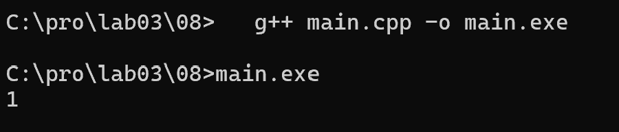
 
* Обозначим A = (x == y), B = (x == z). Тогда выражение принимает вид: A + B == 1.
* Когда выражение истинно:
* x не равен y, но x равен z (например, x = 5, y = 3, z = 5)
* x равен y, но x не равен z (например, x = 5, y = 5, z = 3)
* В этих случаях одно сравнение даёт 1, другое 0. Их сумма 1 + 0 = 1, и 1 == 1 — истина.


```
#include <iostream>
using namespace std;

int main() {
    int x = 5, y = 5, z = 5;
    cout << ((x == y) + (x == z) == true) << endl;
    return 0;
} 
```

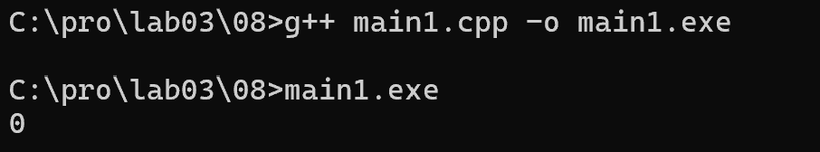

* Когда выражение ложно:
* x равен и y, и z (например, x = 5, y = 5, z = 5). Тогда 1 + 1 = 2, а 2 == 1 — ложь.
* x не равен ни y, ни z (например, x = 5, y = 3, z = 3). Тогда 0 + 0 = 0, а 0 == 1 — ложь.

* Выражение истинно, когда ровно одно из двух сравнений истинно: либо x == y, либо x == z, но не оба одновременно.

*Записанные программы сохраните в папке с номером задания.*


### Задание 9 **(2)**

*Проверьте работу логического выражения*

```x==y==z
```

*в языках* **Python**, **Java**, **C++** *для
целочисленных переменных* **x**, **y**, **z**.
*Объясните результат для каждого из языков.*

* Python:

```
x = 1
y = 2
z = 2
print(x == y == z)
```
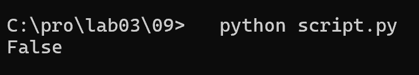
* Python использует цепочные сравнения. x == y == z означает (x == y) and (y == z). 1 == 2 ложно, поэтому всё выражение ложно.

* С++:
```
#include <iostream>
using namespace std;
int main() {
    int x = 1, y = 2, z = 2;
    cout << (x == y == z) << endl;
    return 0;
}
```
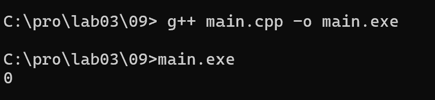

* В C++ оператор == левоассоциативный. Сначала x == y даёт false (0). Затем 0 == z даёт 0 == 2 -> false (0). Выражение интерпретируется как ((x == y) == z).

* Java:
```
public class Main {
    public static void main(String[] args) {
        int x = 1, y = 2, z = 2;
        System.out.println(x == y == z);
    }
}
```
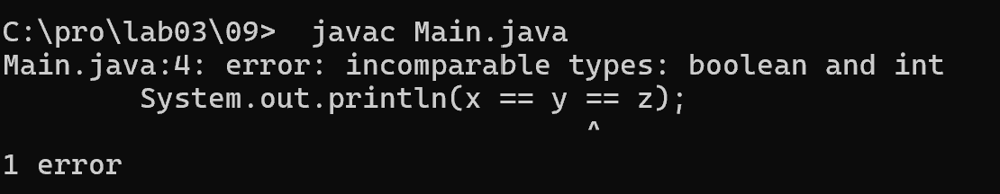

* В Java x == y возвращает boolean, а boolean == int недопустимо. Java — сильно типизированный язык и запрещает такое сравнение. Программа не компилируется.
 
*Записанную программу сохраните в папке с номером задания.*


### Задание 10 **(1))**

*Напишите программу на* **Python** *, демонстрирующую возможность неявного преобразования
строки в логическое значение.*


```
s1 = "hello"
s2 = ""

print(bool(s1))
print(bool(s2))

if s1:
    print("s1 is true")
if not s2:
    print("s2 is false")
```
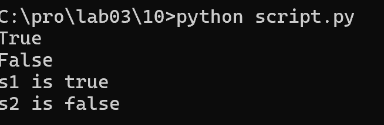

*Записанную программу сохраните в папке с номером задания.*

* В Python любое значение имеет логическую интерпретацию:
* Непустая строка -> True
* Пустая строка "" -> False
* Это используется в условиях if. Когда мы пишем if s1:, Python неявно преобразует строку s1 в логическое значение. Если строка непустая — условие истинно.
* Функция bool() делает то же самое, но явно возвращает True или False.
