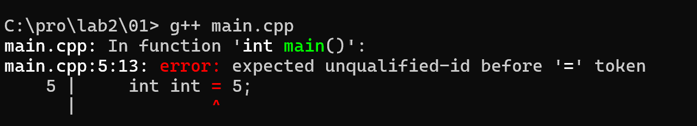
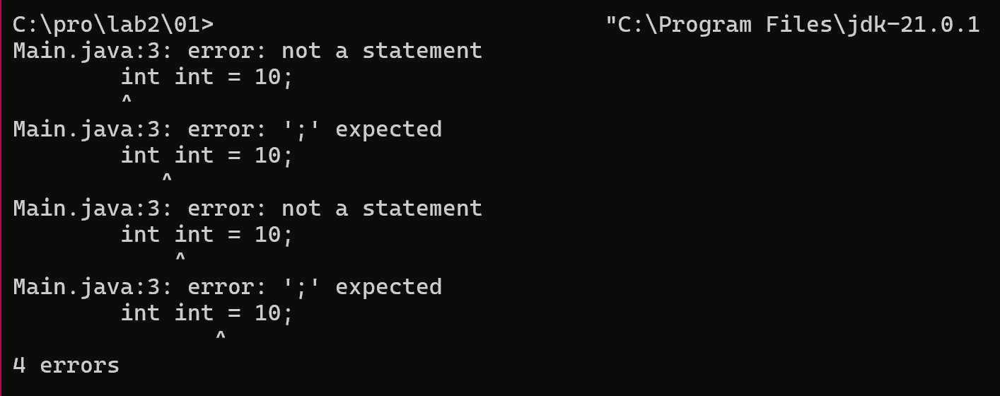
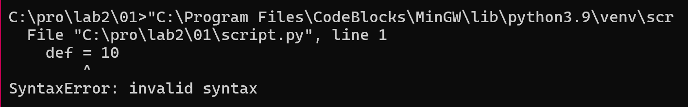
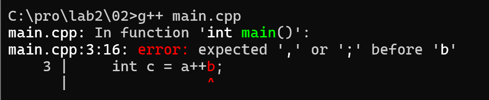
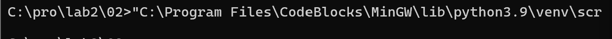
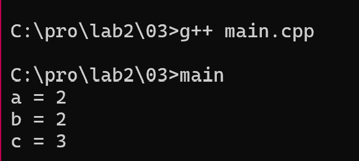
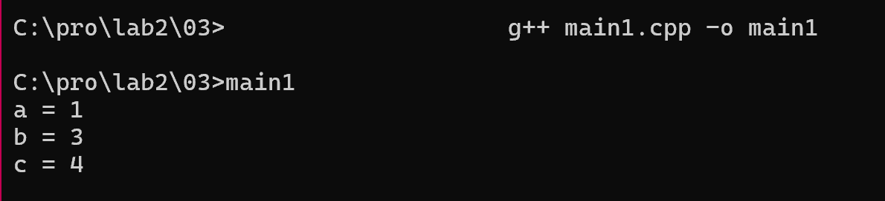
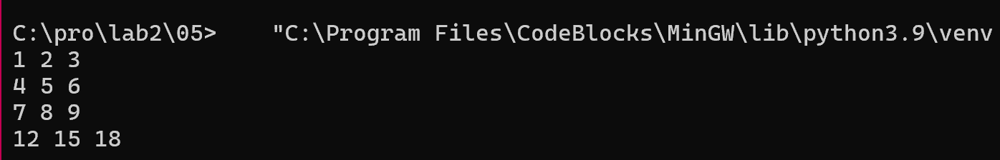

### задание 1
* Ключевые слова из синтаксиса C++: int, if, while, class, return  
![Ошибка компиляции C++] 

* Ключевые слова из синтаксиса Java: int, public, static, void, class
![Ошибка компиляции Java]

* Ключевые слова из синтаксиса Python: def, return, if, while, import 
![Ошибка синтаксиса Python] 

Создать переменные с именами ключевых слов нельзя, так как 
они зарезервированы грамматикой языка для построения структуры программы.

### задание 2
* посмледовательность токенов C++:
int, a, =, 1, ,, b, =, 2, ;, int, c, =, a, ++ , b, ;
Ошибка потому что ++ — это оператор инкремента, поэтому
слитная запись a++b нарушает синтаксис (компилятор ждет операцию или
разделитель перед b). 

* последовательность токенов Python:
a, =, 1, b, =, 2, c, =, a, +, +, b
В Python нет оператора ++. Два плюса это как два отдельных унарных плюса (+ и +).
С точки зрения синтаксиса это превращается в корректную конструкцию 
c = a + (+b), поэтому программа успешно транслируется без ошибок.

### задание 3
* токены: int, a, =, 1, ,, b, =, 2, ;, int, c, =, a, ++, +, b, ;
* значения после выполнения: a=2, b=2, c=3
Три плюса +++ разбиваются на ++ и +. Выражение работает как c = (a++) + b. 

* влияние пробелов: Да, изменяя пробелы, можно изменить разбиение на токены.
Например, запись int c = a + ++b ; заставит анализатор применить префиксный инкремент к переменной b. 

### задание 4
* Квадратные скобки [] всегда выступают в роли оператора индексирования 
(доступа к элементу по индексу, например, в массивах (int numbers[5] = {10, 20, 30, 40, 50};)).
 
* Круглые скобки () становятся оператором в двух случаях: при вызове
функции (имя_функции()) и при явном приведении типов (например, int(x)).
* Круглые скобки НЕ являются оператором int result = (2 + 3) * 4;

 
### задание 5
* выполнение кода 

* Ключевые слова: for, in, input, int, zip, sum, map, print
* Идентификаторы: 
Имена функций и встроенных объектов/методов: print, map, sum, zip, int,
input, split
Имена переменных (параметр цикла): i
* Литералы: 1, 2, 3
* Операторы: * (распаковка), . (метод), () (вызов), [] (список)

* идентификатор задаёт переменные: i 
* идентификатор задаёт имена функции и методов: print, map, sum, zip, int, input, split

* параметры функций: input() - без параматров, считывает строку текста из стандартного ввода
  split() - без параметров, разделение строк
  int - строковое значение из списка, полученного после
  map(...) - принимает функцию и список
  zip(...) - распакованый список
  print(...) - выводит итоговое значение на экран

* что делает программа: она запрашивает у пользователя ввод трёх строк
чисел (эмулируя матрицу), производит их транспонирование (поворот таблицы) 
и вычисляет сумму для каждого получившегося столбца, после чего выводит 
результаты на экран через пробел.

* как приходит к результату: конструкция с циклом for i in (1, 2, 3) 
три раза подряд вызывает ввод строк от пользователя, после чего 
внутренний map вместе с int превращает текстовые фрагменты в полноценные 
числа, а генератор списков упаковывает их в двумерную матрицу. Затем оператор 
распаковки * и функция zip() перестраивают эту матрицу, объединяя элементы 
с одинаковыми индексами в новые группы-столбцы. Внешний map применяет функцию 
sum к каждой группе, суммируя их, а финальный print с оператором * выводит 
полученные суммы на экран

### задание 6
* В C++ существует два вида коментариев: однострочные (начинаются с //) и
многомстрочные (начинаются с /* и заканчиваются */)

cout << "Hello /* Это комментарий */ world";
* синтаксически верно. Коментарий не сработает, потомучто находится внутри кавычек
и выведется строка целиком

// /*
   Это комментарий
   */
* Синтаксически верно. // коментирует пустую строку, а /* многострочный

/* Я комментирую программы /* комментарий */ */
* Синтаксически не верно. В C++ нет поддержки вложенных многострочных комментариев. 
Первый /* открывает комментарий, а самый первый встретившийся */ 
закрывает его 

/* Я комментирую свои программы 
// Это комментарий до конца строки 
*/
* Синтаксически верно. Это многострочный комментарий /* ... */. Внутри него разрешено 
использовать символы //. Компилятор начнет игнорировать код с первого 
/* и закончит только тогда, когда встретит закрывающий */. 
Внутренний // просто станет частью этого большого блока игнорируемого 
текста 

### задание 7
* Как видно из правил, есть 4 инструкции циклов (iteration-statement)

* Первый вид — цикл с предусловием (while), который соответствует строке правила: while ( condition ) statement
* Формат записи: ключевое слово «while» в круглых скобках условие «condition», далее инструкция «statement»
* Пример программы:
int x = 1;
while (x<1000) {
    cout << x;
    x *= 2;
}

* Второй вид — цикл с постусловием (do-while), который соответствует строке правила: do statement while ( expression ) ;
* Формат записи: ключевое слово «do», далее инструкция «statement», после чего ключевое слово «while» с выражением «expression» в круглых скобках, завершающееся точкой с запятой
* Пример программы:
int x = 1;
do {
    cout << x;
    x *= 2;
} while (x<1000);

* Третий вид — цикл со счетчиком (for), который соответствует строке правила: for ( init-statement conditionopt ; expressionopt ) statement
* Формат записи: ключевое слово «for», в круглых скобках через точку с запятой указаны инструкция инициализации «init-statement», необязательное условие «conditionopt» и необязательное выражение «expressionopt», далее инструкция «statement»
* Пример программы:
for (int x = 1; x < 1000; x *= 2) {
    cout << x;
}

* Четвертый вид — цикл обхода диапазонов (range-based for), который соответствует строке правила: for ( for-range-declaration : for-range-initializer ) statement
* Формат записи: ключевое слово «for», в круглых скобках объявление переменной диапазона «for-range-declaration», отделенное двоеточием от инициализатора диапазона «for-range-initializer», далее инструкция «statement»
* Пример программы:
int arr[] = {1, 2, 4, 8, 16};
for (int x : arr) {
    cout << x;
}

### задание 8
* a = -x + y * (z - 1)

       [ = ] 
      /     \
   [ a ]    [ + ] 
           /     \
   [ unary - ]   [ * ] 
       |        /     \
     [ x ]   [ y ]    [ - ] 
                     /     \
                  [ z ]    [ 1 ]
 